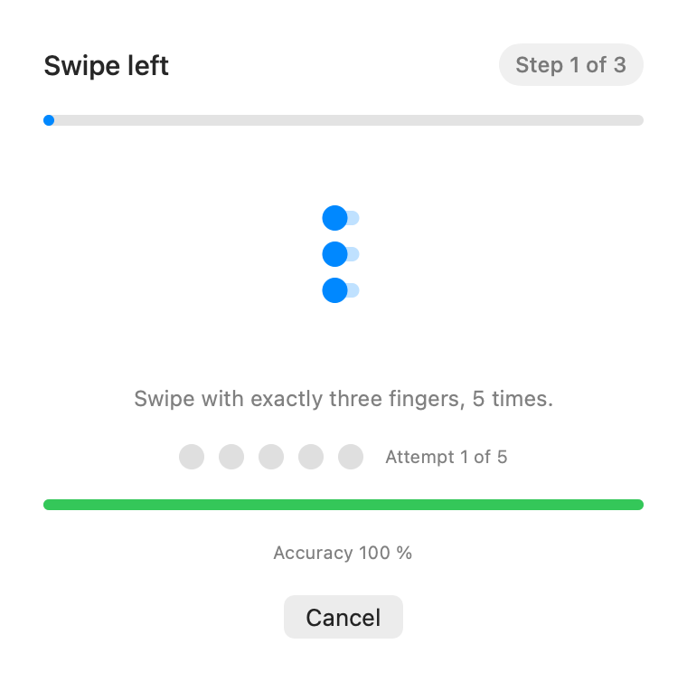

<p align="center">
  
</p>

# Tiler

**Put any window exactly where you want it — without touching the mouse.**

Tiler is a macOS menu-bar utility that snaps the active window into halves, full
screen, or a centered third — on any of your displays — driven by fixed hotkeys and
precise three-finger trackpad swipes.

- **A swipe you can trust.** An action fires only when exactly three fingers move
  decisively in one direction. Ordinary scrolling, resting palms, momentum flicks and
  stray touches never move your windows — false positives are treated as
  release-blocking bugs, and the recognizer is guarded by replayed real-trackpad
  recordings.
- **Tuned to your hand.** Everyone swipes differently. A one-minute guided
  calibration measures your own strokes with live feedback and adapts the recognition
  angles — clamped to ranges that provably cannot re-enable false positives.
- **Featherweight and unbreakable.** Event-driven engine: under 1% CPU whenever your
  fingers are off the pad (measured as true utilization in three states on every
  release), no event taps or input hooks that could ever jam your keyboard, alive
  without permissions, instant recovery when they change, and force-kill-safe.

## Shortcuts and gestures

| Input | Action |
|---|---|
| ⌃⇧← / ⌃⇧→ | left / right half of the current screen |
| ⌃⇧↑ | maximize (after a 0.3 s double-press window) |
| ⌃⇧↑ ↑ (double press) | full height, centered, ⅓ width |
| ⌃⇧↓ | restore the window's previous frame |
| ⌘⌃⇧← / ⌘⌃⇧→ | halves on the next display |
| 3-finger swipe ← / → / ↑ | left half / right half / maximize |
| ⌘ + 3-finger swipe ← / → | halves on the next display |

Swipe-down, two- and four-finger movements do nothing — by design. The full
reference with animated demos lives in the app: menu bar → **Tiler**.

<p align="center">
  
  
</p>

## Install

```sh
git clone git@github.com:amilabs/Tiler.git && cd Tiler
Scripts/install.sh          # builds, signs, installs to ~/Applications
open ~/Applications/Tiler.app
```

Requirements: macOS 26+, Xcode toolchain, a codesigning identity (free Apple
Development works — see [docs/tcc-enrollment.md](docs/tcc-enrollment.md) for why
self-signed certificates won't do).

On first launch Tiler opens its guide and asks for the **Accessibility** permission —
the one capability it needs to move windows. Without it Tiler stays alive and shows a
⚠︎ in the menu bar; grant it and everything starts working within seconds, no
relaunch. If system three-finger gestures (Mission Control, three-finger drag) are
enabled, Tiler detects the conflict and tells you exactly what to change.

## When gestures misbehave

Open **Tiler → Settings → Gestures → Calibrate**: an animated prompt walks you
through each swipe, marks every attempt recognized/missed (with the measured angle),
and derives personal thresholds. `Reset to defaults` brings back stock behavior.
`Scripts/diagnose.sh` mirrors the in-app conflict diagnostics from the CLI.

## Development

Spec-driven (OpenSpec): current requirements in [openspec/specs/](openspec/specs/),
full design history in [openspec/changes/archive/](openspec/changes/archive/).
Gesture logic is a pure, exhaustively unit-tested state machine (`TilerCore`);
system integration (`TilerSystem`) is covered by integration tests against real
windows plus hotkey E2E. Golden trackpad recordings are replayed in CI-grade tests;
`Scripts/run-acceptance.sh` checks launch health, true idle CPU in three states, and
kill -9 resilience.

```sh
swift test                   # 96 tests
Scripts/run-acceptance.sh    # self-service acceptance
Scripts/record-golden.sh     # record a real-trackpad trace into a fixture
```

Verified on **macOS 26.5 (Apple Silicon)** only — all acceptance claims refer to that
configuration. License: Apache-2.0.
