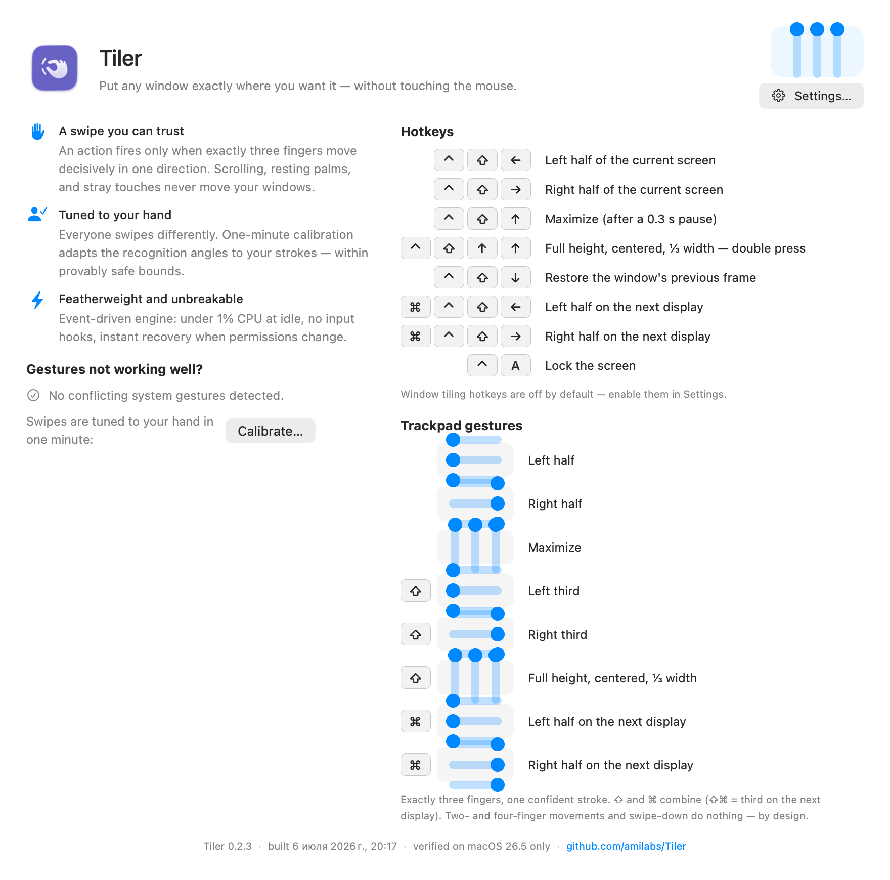

  

# Tiler

A macOS menu-bar utility that places the active window with hotkeys and
three-finger trackpad swipes: halves, full screen, a centered third — on any of
your displays.

- Recognizes a swipe only when exactly three fingers move together in one
  direction, so ordinary scrolling and resting palms don't affect your windows.
- Swipe angles can be calibrated to your hand in about a minute.
- Light on resources: under 1% CPU when your fingers are off the trackpad.

## Shortcuts and gestures

| Input | Action |
|---|---|
| ⌃⇧← / ⌃⇧→ | left / right half of the current screen |
| ⌃⇧↑ | maximize |
| ⌃⇧↑ ↑ (double press) | full height, centered, ⅓ width |
| ⌃⇧↓ | restore the window's previous frame |
| ⌘⌃⇧← / ⌘⌃⇧→ | halves on the next display |
| ⌃A | lock the screen |
| 3-finger swipe ← / → / ↑ | left half / right half / maximize |
| ⇧ + 3-finger swipe ← / → / ↑ | left third / right third / centered third |
| ⌘ + 3-finger swipe ← / → | halves on the next display (⇧ combines: thirds) |

Swipe-down, two- and four-finger movements do nothing. The full reference lives
in the app: menu bar → **Tiler**.

## Install

1. Download `Tiler-x.y.z.zip` from [Releases](https://github.com/amilabs/Tiler/releases).
2. Unzip and move `Tiler.app` to `~/Applications`.
3. Open it and grant the **Accessibility** permission when asked — that's the one
   thing Tiler needs to move windows.

Window-tiling hotkeys (⌃⇧ arrows) are **off by default** — turn them on in
**Settings → General** if you want them alongside the gestures. The ⌃A lock-screen
hotkey is on by default.

Requires macOS 26 or later (verified on macOS 26.5, Apple Silicon).

## If gestures don't work well

Open **Tiler → Settings → Gestures → Calibrate** — a guided one-minute dialog
adapts recognition to how you actually swipe. If system three-finger gestures
(Mission Control, three-finger drag) are enabled, Tiler will point at the exact
setting to change.

---

License: Apache-2.0
